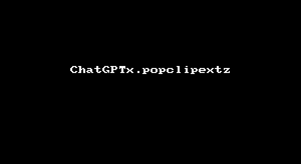

# A [PopClip](https://pilotmoon.com/popclip/) Extension Powered by ChatGPT

NOTE: Installing this extension will trigger a warning as it is not an officially [signed extension](https://github.com/pilotmoon/PopClip-Extensions#extension-signing) from Pilotmoon Software. If you have any doubts, please take the time to review the source code.

Download: [**Buy Me A Coffee**](https://ko-fi.com/s/efa2b30d72) | [**Thanks, Perhaps Next Time**](https://github.com/damnever/ChatGPTx.popclipext/releases/latest/download/ChatGPTx.popclipextz)

## Features

- Chat with ChatGPT using any text you have selected.
    - Per application chat histories (the chat histories are only kept for contextual use and are currently hidden).
    - The histories will expire automatically if there is no interaction with the application for 20 minutes. Click while holding the shift (⇧) key to force clear the history.
- Opinioned actions:
    - Revising texts with reasons.
    - Polishing texts and correcting the grammar.
    - Translating texts.
    - Summarizing texts.
    - The above functions will use the primary language by default, click while holding the shift (⇧) key to use the secondary languages.
- Any API that is compatible with [the OpenAI chat completions API](https://platform.openai.com/docs/api-reference/chat/create) is supported.
    - Special support for [the Microsoft Azure OpenAI service](https://learn.microsoft.com/en-us/azure/ai-services/openai/reference#chat-completions).
        - Base URL format: `https://{resource-name}.openai.azure.com/openai/deployments/{deployment-id}?api-version={api-version}` (it will trim the `/chat/completions` suffix by default)

This extension will attempt to paste(append) the result directly into the active application if the paste command is available. If not, it will copy the result and provide a preview(with possible truncation due to the current limitations of PopClip). NOTE that some applications might have the paste command, but nothing was pasted. You can click while holding option(⌥) to force a preview instead of trying to paste first.

**NOTE:** at the moment, no additional AI services or opinioned actions will be added as there are already too many, making the settings UI too crowded.

## Thanks

This extension is inspired by [chatGPTBox](https://github.com/josStorer/chatGPTBox) and [ChatGPT.popclipext](https://github.com/pilotmoon/PopClip-Extensions/tree/master/source/ChatGPT.popclipext).
